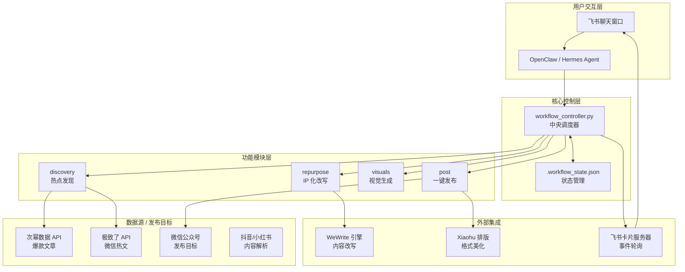
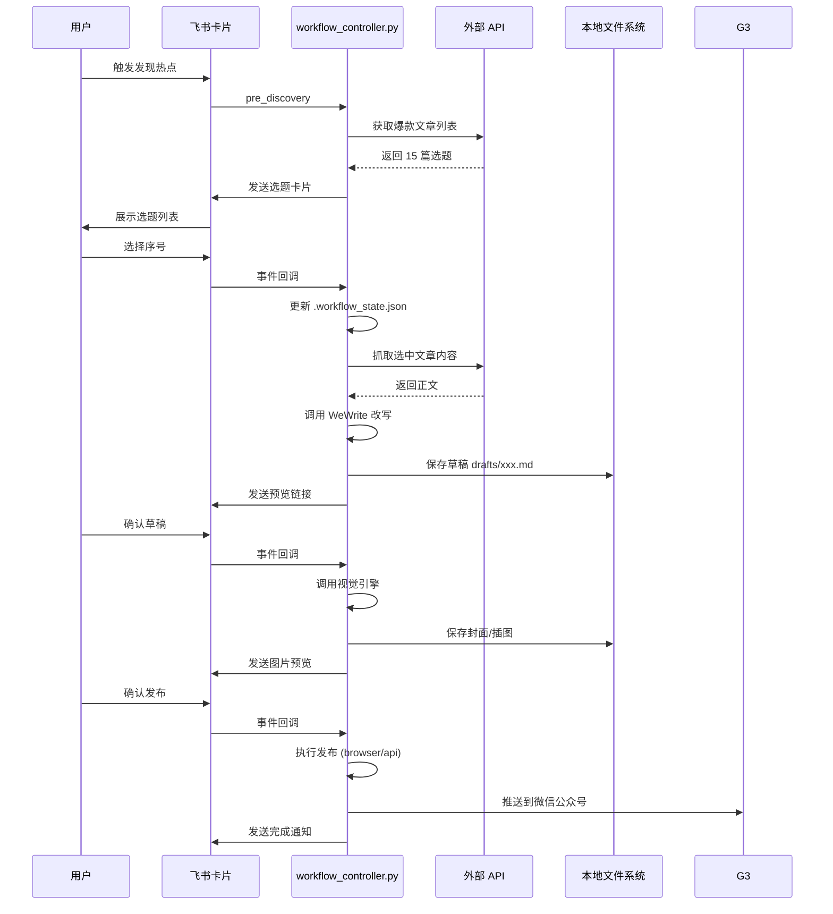

# self-media-auto

**自媒体自动化全流程工具** — 面向微信公众号的一站式内容生产解决方案。

从热点发现、内容二创、视觉生成到一键发布，完整工作流自动化。

---

## 核心功能

| 功能模块 | 说明 |
|---------|------|
| 🔥 **热点发现** | 从次幂数据 API / 极致了 API 获取各平台爆款文章/视频 |
| 📝 **内容改写** | 使用 WeWrite 引擎进行 IP 化改写，输出短视频脚本 + 公众号长文 |
| 🎨 **视觉生成** | 自动生成 16:9 封面图和文中插图（支持 Wan2.1 / Seedream 等模型） |
| 📤 **一键发布** | 通过浏览器 CDP 或 API 发布到微信公众号草稿箱 |
| 📱 **飞书集成** | 卡片式交互界面，实时状态通知 + 审核预览 |

**内容来源支持：** 微信公众号文章、抖音视频、小红书笔记  
**发布目标：** 微信公众号

---

## 快速开始

### 前置条件

- Python 3.12+
- Node.js 20+（可选，用于 npm 依赖）
- Bun（可选，更快的 JS 包管理）

### 三步安装

**1. 克隆项目**

```bash
# OpenClaw 环境
cd ~/.claude/plugins/openclaw/skills
git clone <repo-url> self-media-auto

# Hermes Agent 环境
cd /opt/hermes/skills
git clone <repo-url> self-media-auto
```

**2. 配置环境变量**

复制 `.env.example` 为 `.env` 并填写必要的 API 密钥：

```bash
cp .env.example .env
```

编辑 `.env` 文件，至少配置4 配置以下核心密钥：

```ini
# 必需 - 大模型 API
OPENAI_API_KEY=sk-your_api_key_here
OPENAI_BASE_URL=https://api.openai.com/v1

# 必需 - 作者 IP 名称
AUTHOR_IP_NAME="你的 IP 名称"

# 可选 - 爆款文章 API（二选一）
CIMI_APP_ID=your_cimi_app_id
CIMI_APP_SECRET=your_cimi_app_secret

JIZHILE_KEY=your_jizhile_key
HOT_ARTICLE_PROVIDER=jizhile

# 可选 - 微信公众号 API 发布
WECHAT_APP_ID=your_app_id
WECHAT_APP_SECRET=your_app_secret

# 可选 - 生图模型
DASHSCOPE_API_KEY=your_dashscope_key
```

**3. 安装依赖**

```bash
# Python 依赖
python -m venv .venv
.venv\Scripts\activate  # Windows
source .venv/bin/activate  # Linux/Mac

# 使用 uv（推荐，更快）
uv pip install -e .

# 或使用 pip
pip install -e .

# 安装外部工具
pip install xiaohongshu-cli
playwright install chromium

# Node.js 依赖（发布模块）
cd scripts/posting
npm install  # 或 bun install
```

### 运行第一个命令

```bash
# 发现科技类爆款文章
python workflow_controller.py discovery --keyword 科技

# 从公众号文章链接直接开始
python workflow_controller.py from-article --url "https://mp.weixin.qq.com/s/xxxxx"
```

---

## 架构说明

### 系统架构图



### 数据流图



### 核心组件说明

| 组件 | 位置 | 职责 |
|-----|------|------|
| `workflow_controller.py` | `scripts/workflow/` | 中央调度器，所有命令的入口 |
| `.workflow_state.json` | 项目根目录 | 工作流状态记录，支持断点续传 |
| `feishu-card-server.py` | `scripts/feishu/` | 飞书事件轮询服务器（5 秒间隔） |
| `WeWrite 引擎` | `scripts/modules/wewrite/` | IP 化内容改写引擎 |
| `Xiaohu 排版` | `scripts/formatting/` | 公众号文章格式美化 |
| `douyin-download-1.2.0` | `scripts/modules/` | 抖音视频下载 + ASR |
| `url-reader-0.1.1` | `scripts/modules/` | 通用网页内容提取 |

---

## 部署指南

### 4.1 OpenClaw 本地部署

**适用场景：** 个人本地开发环境，直接在本地运行所有组件。

#### 部署步骤

**1. 技能安装**

将本技能目录链接到 OpenClaw 技能目录：

```bash
# 如果技能已在 .openclaw/skills/self-media-auto
# OpenClaw 会自动识别并使用
```

**2. 环境检查**

```bash
# 检查 Python 版本（需要 3.12+）
python --version

# 检查 uv（可选，加速依赖安装）
uv --version

# 检查 Bun 或 npm（用于 Node.js 依赖）
bun --version  # 或 npm --version
```

**3. 安装依赖**

```bash
cd c:\Users\Administrator\.openclaw\skills\self-media-auto

# 创建虚拟环境
python -m venv .venv

# 激活虚拟环境（Windows）
.venv\Scripts\activate

# 安装 Python 依赖
uv pip install -e .  # 推荐，或使用 pip install -e .

# 安装 Playwright 浏览器
playwright install chromium

# 安装 Node.js 依赖
cd scripts\posting
npm install
cd ..\..
```

**4. 配置飞书卡片服务器**

```bash
# 启动卡片服务器（后台运行）
python scripts\feishu\feishu-card-server.py

# 或使用批处理脚本
scripts\feishu\start_card_server.bat
```

**5. 验证部署**

```bash
# 运行环境检查命令
python workflow_controller.py status
```

#### OpenClaw 特殊配置

OpenClaw 环境下，技能会自动加载 `SKILL.md` 作为指令集。确保：

1. `.env` 文件包含必要的 API 密钥
2. 飞书卡片服务器处于运行状态
3. OpenClaw 有权限访问技能和输出目录

---

### 4.2 Hermes Agent 服务器部署

**适用场景：** 远程服务器 / 团队共享环境，支持多用户并发使用。

#### 服务器环境要求

| 要求 | 说明 |
|------|------|
| 操作系统 | Linux (Ubuntu 22.04+) 或 Windows Server |
| Python | 3.12+ |
| Node.js | 20+ |
| 内存 | 建议 4GB+（生图时 Chrome 占用较高） |
| 存储 | 建议 10GB+（用于缓存图片和日志） |
| 网络 | 需访问微信公众号、飞书 API、AI 模型 API |

#### 部署步骤

**1. 代码同步**

```bash
# 服务器环境
cd /opt/hermes/skills
git clone <repo-url> self-media-auto
cd self-media-auto

# 或使用 rsync 从本地同步
rsync -avz --exclude='.venv' --exclude='logs/*' \
  ./self-media-auto/ \
  user@hermes-server:/opt/hermes/skills/self-media-auto/
```

**2. 安装依赖**

```bash
# Python 虚拟环境
python3 -m venv .venv
source .venv/bin/activate

# 安装依赖
uv pip install -e .  # 或 pip install -e .
playwright install chromium
playwright install-deps chromium  # Linux 需要额外系统依赖

# Node.js 依赖
cd scripts/posting
npm install
cd ../..
```

**3. 配置环境变量**

```bash
cp .env.example .env
nano .env  # 编辑配置
```

**服务器环境特别注意：**

- 确保 `OPENAI_BASE_URL` 可从服务器访问（某些云环境可能需要代理）
- 微信公众号 API 发布需要服务器 IP 在白名单中

**4. 配置 systemd 服务（Linux）**

创建 `/etc/systemd/system/self-media-card-server.service`：

```ini
[Unit]
Description=Self Media Feishu Card Server
After=network.target

[Service]
Type=simple
User=hermes
WorkingDirectory=/opt/hermes/skills/self-media-auto
Environment="PATH=/opt/hermes/skills/self-media-auto/.venv/bin"
ExecStart=/opt/hermes/skills/self-media-auto/.venv/bin/python scripts/feishu/feishu-card-server.py
Restart=always
RestartSec=5

[Install]
WantedBy=multi-user.target
```

启动服务：

```bash
sudo systemctl daemon-reload
sudo systemctl enable self-media-card-server
sudo systemctl start self-media-card-server
sudo systemctl status self-media-card-server
```

**5. 配置 Windows 服务（Windows Server）**

使用 NSSM（Non-Sucking Service Manager）：

```cmd
# 下载 NSSM 后
nssm install SelfMediaCardServer
nssm set SelfMediaCardServer Application "C:\path\to\python.exe"
nssm set SelfMediaCardServer AppParameters "scripts\feishu\feishu-card-server.py"
nssm set SelfMediaCardServer AppDirectory "C:\path\to\self-media-auto"
nssm set SelfMediaCardServer DisplayName "Self Media Card Server"
nssm set SelfMediaCardServer StartService SERVICE_AUTO_START
nssm start SelfMediaCardServer
```

**6. 日志轮转（可选）**

创建 `/etc/logrotate.d/self-media`：

```
/opt/hermes/skills/self-media-auto/logs/*.log {
    daily
    rotate 7
    compress
    delaycompress
    missingok
    notifempty
    create 0640 hermes hermes
}
```

#### 后台运行配置

**方式一：使用 screen（临时）**

```bash
screen -S card-server
python scripts/feishu/feishu-card-server.py
# Ctrl+A, D 脱离 screen
```

**方式二：使用 nohup**

```bash
nohup python scripts/feishu/feishu-card-server.py > logs/card-server.log 2>&1 &
```

#### 多用户并发支持

Hermes Agent 环境下，多个用户可能同时使用。建议：

1. **独立工作目录：** 为每个用户创建独立的工作目录和 `.env` 配置
2. **状态隔离：** `.workflow_state.json` 按用户 ID 命名区分
3. **资源限制：** 使用 cgroups 或 Docker 限制每个进程的 CPU/内存使用

---

## 配置说明

### .env 完整配置项

#### 核心必需（缺少无法使用）

| 变量名 | 说明 | 获取方式 |
|--------|------|----------|
| `OPENAI_API_KEY` | 大模型 API 密钥 | OpenAI / DeepSeek / Qwen 等 |
| `OPENAI_BASE_URL` | API 基础 URL | 根据选择的模型提供商填写 |
| `AUTHOR_IP_NAME` | 作者 IP 名称 | 自定义，如 "大胡" |

#### 爆款文章 API（二选一）

**极致了 API（推荐，成本更低）：**

| 变量名 | 说明 | 默认值 |
|--------|------|--------|
| `HOT_ARTICLE_PROVIDER` | Provider 选择 | `jizhile` |
| `JIZHILE_KEY` | 极致了 API 密钥 | - |
| `JIZHILE_CATEGORY` | 分类 ID（7=科技） | `7` |
| `JIZHILE_KEYWORD` | 搜索关键词 | `OpenClaw` |

**次幂数据 API（备选）：**

| 变量名 | 说明 |
|--------|------|
| `CIMI_APP_ID` | 次幂应用 ID |
| `CIMI_APP_SECRET` | 次幂应用密钥 |
| `CIMI_CATEGORY` | 次幂分类（如 `keji`） |

#### 可选功能

**微信公众号 API 发布：**

| 变量名 | 说明 | 获取位置 |
|--------|------|----------|
| `WECHAT_APP_ID` | 公众号 AppID | 微信公众平台 → 开发 → 开发密钥 |
| `WECHAT_APP_SECRET` | 公众号 AppSecret | 同上 |

**视觉生成（各模型 API）：**

| 变量名 | 说明 | 适用模型 |
|--------|------|----------|
| `DASHSCOPE_API_KEY` | 阿里云百炼 API | 通义万相 / Seedream |
| `WAN_API_KEY` | Wan2.1 API | Wan2.1 生图 |
| `SEEDREAM_API_KEY` | Seedream API | 火山引擎 Seedream |

**视频语音转写：**

| 变量名 | 说明 |
|--------|------|
| `SILI_FLOW_API_KEY` | 硅基流动 API（视频 ASR） |

**飞书集成：**

| 变量名 | 说明 | 获取位置 |
|--------|------|----------|
| `FEISHU_APP_ID` | 飞书应用 ID | 飞书开放平台 → 应用管理 |
| `FEISHU_APP_SECRET` | 飞书应用密钥 | 同上 |
| `FEISHU_CARD_TOKEN` | 飞书卡片机器人 Token | 同上 |

### API 密钥获取指南

#### OpenAI / 兼容 API

1. 访问 https://platform.openai.com/api-keys
2. 创建新的 API Key
3. 复制并填写到 `OPENAI_API_KEY`

**国内替代：**
- DeepSeek: https://platform.deepseek.com/
- 通义千问：https://dashscope.console.aliyun.com/

#### 次幂数据 API

1. 访问 https://www.cimi.la/
2. 注册账号并创建应用
3. 获取 AppID 和 AppSecret

#### 极致了 API

1. 访问极致了数据平台
2. 注册并获取 API Key
3. 参考 `docs/hot_typical_search.md` 了解分类代码

#### 微信公众号

1. 登录 https://mp.weixin.qq.com/
2. 开发 → 基本配置 → 成为开发者
3. 获取 AppID 和 AppSecret

---

## 使用指南

### 完整工作流示例

#### 场景一：从零开始做一期内容

```bash
# Step 1: 发现热点
python workflow_controller.py discovery --keyword 科技

# Step 2: 用户选择选题后，执行改写
python workflow_controller.py repurpose --id 3

# Step 3: 确认草稿后，生成配图并发布
python workflow_controller.py publish --model wan --method browser
```

#### 场景二：已知文章链接，直接改写

```bash
# 从公众号文章链接开始
python workflow_controller.py from-article --url "https://mp.weixin.qq.com/s/xxxxx"

# 自动进入 repurpose 流程，确认草稿后发布
```

#### 场景三：抖音视频转公众号文章

```bash
# 从抖音视频链接开始
python workflow_controller.py from-video --url "https://v.douyin.com/xxxxx"

# 自动下载视频 → 提取音频 → ASR 转写 → 改写 → 发布
```

### 命令速查表

| 命令 | 说明 | 常用参数 |
|------|------|----------|
| `setup` | 首次使用配置引导 | - |
| `pre_discovery` | 触发飞书选题卡片 | `--keyword <行业>` |
| `discovery` | 获取爆款文章列表 | `--keyword <序号/行业>` `--last_id <游标>` |
| `from-article` | 从文章 URL 抓取 | `--url <URL>` |
| `from-video` | 从视频 URL 提取 | `--url <URL>` |
| `repurpose` | IP 化改写 | `--id <素材 ID>` `--script-only` `--article-only` |
| `visuals` | 仅生成配图 | `--model <wan\|seedream\|qwen>` |
| `post` | 仅执行发布 | `--method <browser\|api>` |
| `publish` | 配图 + 发布一键执行 | `--model <model>` `--method <method>` |
| `sync` | 同步到飞书知识库 | `--script <路径>` `--article <路径>` |
| `status` | 查看当前任务状态 | - |
| `next` | 浏览选题列表下一页 | - |

### 飞书交互说明

**卡片服务器启动：**

```bash
# 后台运行
python scripts/feishu/feishu-card-server.py

# 或使用批处理
scripts/feishu/start_card_server.bat
```

**事件轮询：** 服务器每 5 秒轮询一次飞书事件，检测用户操作。

**卡片类型：**

| 卡片类型 | 触发时机 | 用户操作 |
|---------|---------|---------|
| 选题方式选择 | `pre_discovery` | 选择发现方式 |
| 选题列表 | `discovery` | 点击选题序号 |
| 草稿预览 | `repurpose` 完成后 | 点击链接审核 |
| 图片预览 | `visuals` 完成后 | 查看封面/插图 |
| 发布通知 | `post` 完成后 | - |

---

## 故障排查 FAQ

### 常见问题

| 问题 | 可能原因 | 解决方案 |
|------|---------|---------|
| `.env 配置不完整` | 首次使用未配置密钥 | 运行 `setup` 命令或手动编辑 `.env` |
| `API 调用失败` | 密钥无效/网络问题 | 检查密钥有效性，确认账户状态 |
| `素材抓取失败` | URL 不支持/反爬 | 尝试更换链接，或使用次幂 API 兜底 |
| `生图失败` | API 配额不足 | 检查账户余额，或更换生图模型 |
| `XiaohuGalleryError` | Chrome 启动失败 | 检查 Playwright 配置，重启浏览器 |
| `WeWrite 改写失败` | API 配额不足 | 自动重试，失败后降级到基础改写 |
| `ffmpeg 未检测到` | 系统未安装 | 语音转写功能受限，使用标题生成 |
| `卡片服务器无响应` | 端口占用/未启动 | 检查端口占用，重启卡片服务器 |

### 日志查看

日志文件位于 `logs/` 目录：

```bash
# 查看最新日志
tail -f logs/workflow.log

# 查看错误日志
grep ERROR logs/workflow.log
```

### 联系支持

如遇问题无法解决，请提供以下信息：

1. 错误日志输出
2. `.env` 配置（隐藏敏感信息）
3. 执行的命令和输入参数

---

## 附录

### 行业分类参考

**极致了 API 分类代码：**

| 代码 | 分类 |
|------|------|
| 1 | 情感 |
| 2 | 职场 |
| 3 | 财经 |
| 4 | 教育 |
| 5 | 健康 |
| 6 | 美食 |
| 7 | 科技 |
| 8 | 游戏 |
| 9 | 旅游 |
| 10 | 时尚 |

**次幂数据 API 分类：** 使用拼音名称，如 `keji`（科技）、`caijing`（财经）等。

### 文件结构

```
self-media-auto/
├── SKILL.md                    # OpenClaw 技能定义
├── README.md                   # 本文件
├── .env                        # 环境变量配置
├── .env.example                # 配置模板
├── .workflow_state.json        # 工作流状态（运行时）
├── scripts/
│   ├── workflow/
│   │   └── workflow_controller.py   # 中央调度器
│   ├── feishu/
│   │   ├── feishu-card-server.py    # 卡片服务器
│   │   └── start_card_server.bat    # 启动脚本
│   ├── posting/
│   │   └── wechat-article.ts        # 浏览器发布
│   ├── formatting/
│   │   └── format.py                # 排版模块
│   └── modules/
│       ├── wewrite/                 # WeWrite 改写引擎
│       ├── douyin-download-1.2.0/   # 抖音视频下载
│       └── url-reader-0.1.1/        # 网页内容提取
├── drafts/                     # 草稿输出目录
├── logs/                       # 日志目录
└── covers/                     # 封面图输出目录
```

---

## 许可证

MIT License
